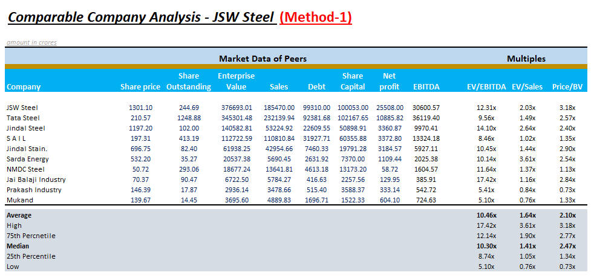
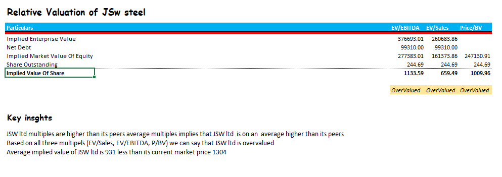
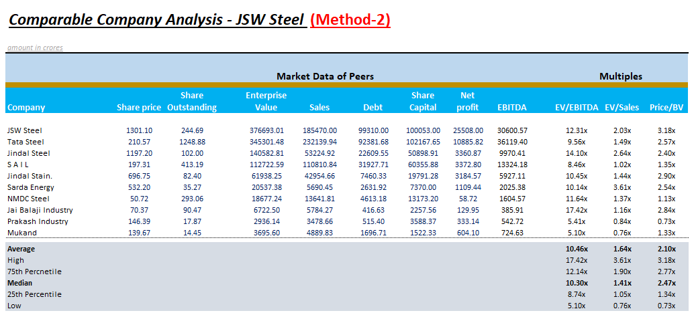
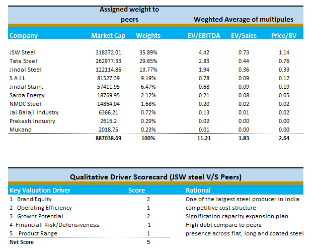
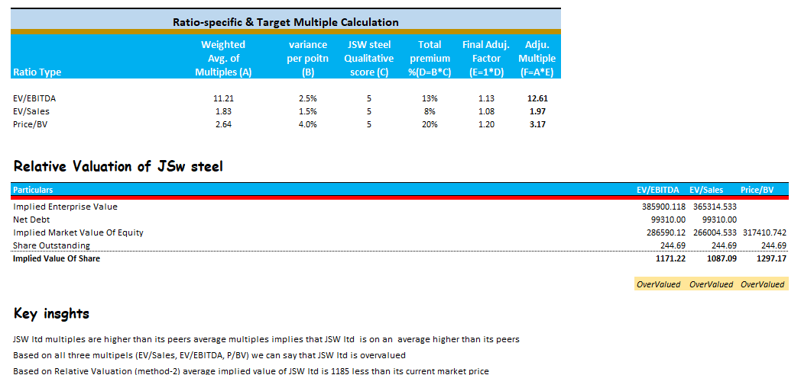

# JSW Steel – Relative Valuation

## Project Overview

This project performs a Comparable Company Analysis and Relative Valuation of JSW Steel using peer-company trading multiples.

The analysis compares JSW Steel with selected companies from the Indian steel industry and estimates an implied value per share using:

- EV/EBITDA
- EV/Sales
- Price/Book Value

Two valuation approaches have been used:

1. Peer Average Multiple Method
2. Weighted Average Multiple + Qualitative Adjustment Method

---

## Excel Model

The complete financial model is available here:

**[Download / View Excel DCF Model](JSW_Relative_Valuation.xlsx)**

---

## Objective

The objective of this analysis is to estimate the implied value of JSW Steel based on the valuation multiples observed among comparable companies.

The analysis also incorporates qualitative factors such as:

- Brand Equity
- Operating Efficiency
- Growth Potential
- Financial Risk / Defensiveness
- Product Range

---

## Peer Companies

The comparable-company set includes:

- Tata Steel
- Jindal Steel
- SAIL
- Jindal Stainless
- Sarda Energy
- NMDC Steel
- Jai Balaji Industries
- Prakash Industries
- Mukand

---
## Valuation Methodology

### Method 1 – Peer Average Multiples
1. Collect market data (price, shares, EV, sales, debt, net worth, net profit, EBITDA).
2. Calculate EV/EBITDA, EV/Sales and P/BV for each company.
3. Compute average, median, high, low and quartiles.
4. Apply peer multiples to JSW's financials to get an implied value per share.

### Method 2 – Weighted Average + Qualitative Adjustment

1. Weight each peer's multiples by its market capitalisation.
2. Score JSW against peers on five qualitative drivers (brand equity, operating efficiency, growth potential, financial risk, product range). Net score: **5**.
3. Convert the score into a premium (2.5% per point for EV/EBITDA, 1.5% for EV/Sales, 4.0% for P/BV).
4. Apply the adjusted multiples to JSW to get an implied value per share.

## Key Valuation Outputs

The analysis produces implied share prices using three valuation multiples:

| Multiple | Method 1 | Method 2 |
|----------|----------|----------|
| EV/EBITDA | ₹1,133.59 | ₹1,171.22 |
| EV/Sales | ₹659.49 | ₹1,087.09 |
| Price/Book | ₹1,009.96 | ₹1,297.17 |

The current share price used in the model is approximately ₹1,301.

Under Method 2, the average implied value across the three approaches is approximately ₹1,185 per share.

---

## Key Insights
- JSW trades at a premium to the peer median on all three multiples.
- Both methods suggest JSW is **overvalued** versus peers.
- The gap narrows once JSW's strengths (scale, cost position, expansion plans) are reflected in Method 2.
- P/BV under Method 2 (₹1,297) is very close to the market price.

  ---

## Limitations
- Small peer group with very different sizes.
- Qualitative scores and premium per point are subjective assumptions.
- Multiples are based on a single point in time.

  ---

## Skills Demonstrated

- Comparable Company Analysis
- Financial Modeling
- Weighted Average Multiples
- Qualitative Valuation
- Equity Valuation
- Excel Financial Modeling

  ---

  ## Disclaimer

This project is for educational and analytical purposes only and does not constitute investment advice.

---
  
## Author
Utkarsh Singh Malra 
